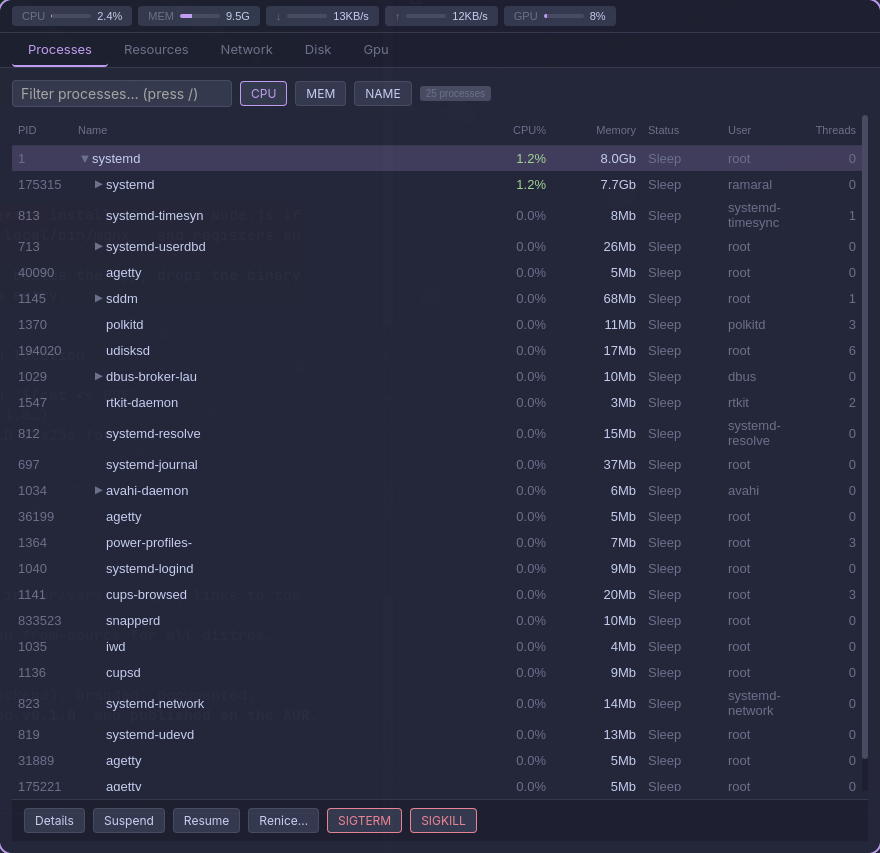

<p align="center">
  
</p>

<p align="center">
  Processes, resources, network, disk and GPU — in one keyboard-driven,
  <br>Catppuccin-themed window. Built with Tauri&nbsp;v2&nbsp;+&nbsp;React.
</p>

<p align="center">
  
  
  
  
  
  <a href="https://aur.archlinux.org/packages/mgnx"></a>
</p>

<p align="center">
  <code>Processes</code> · <code>Resources</code> · <code>Network</code> · <code>Disk</code> · <code>GPU</code>
</p>

<p align="center">
  
</p>

---

## Features

- **Process tree** — htop-style, grouped by parent; expand/collapse with one keypress. Folded nodes roll up accumulated CPU and (PSS) memory for the whole subtree.
- **Pin** any process — and its parent chain — to the top of the list.
- **Manage** — sort by CPU/mem/name, live filter, CPU heat coloring, signals (kill · term · suspend · resume · renice), and a details drawer.
- **Resources** — per-core CPU bars, RAM/swap usage, and sparkline history.
- **Network** — per-interface rx/tx rates and active connections.
- **Disk** — usage per mount, plus inode stats.
- **GPU** — NVIDIA (NVML) and AMD (rocm-smi): usage, VRAM, temperature, power, clocks, and GPU processes.
- **Keyboard-driven** throughout, in a Catppuccin Macchiato theme.

## Keyboard

| Key | Action |
|-----|--------|
| `←` `→` | Switch tabs |
| `↑` `↓` | Move the process selection |
| `Enter` | Expand / collapse the selected process |
| `Space` | Pin / unpin the selected process |
| `/` | Focus the filter |
| `Esc` | Clear the selection |
| `Tab` `⇧ Tab` | Move focus between the filter and sort buttons |
| Right-click | Open the process actions menu |

## Install

**Arch Linux** — from the AUR:

```bash
yay -S mgnx      # or: paru -S mgnx
```

**From source** (Arch · Debian/Ubuntu · Fedora):

```bash
git clone https://github.com/Svynct/mgnx.git
cd mgnx
./install.sh
```

`install.sh` installs Rust and Node.js if missing, builds the app, drops the binary at `~/.local/bin/mgnx`, and registers an app-menu entry.

```bash
INSTALL_DIR=/usr/local/bin ./install.sh   # custom location
./uninstall.sh                            # remove the binary (keeps shared deps)
```

## Requirements

- Linux (Wayland or X11)
- Rust 1.77+ (stable)
- Node.js 20+
- NVIDIA GPU tab needs `nvidia-smi`; AMD GPU tab needs `rocm-smi`

## Development

```bash
npm install
npm run tauri -- dev
```

```bash
cd src-tauri && cargo test   # Rust backend
npm test                     # frontend (vitest)
```
